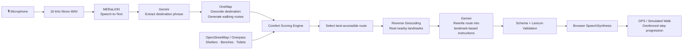

# EZ Jalan

**Voice-first navigation for seniors in Singapore.**

Press one button, say where you want to go in your preferred language, and receive simple spoken directions based on nearby landmarks.

> Typical navigation: *"Head northwest on Ang Mo Kio Avenue 10 for 240 metres."*

> EZ Jalan: *"Walk to the market. Turn right at the bus stop. There’s a bench nearby if you need to rest."*

*Seniors navigate by landmarks, not street names and distances.*

Built for the *Vibe for Good Hackathon 2026*.

**Features** 
- Multilingual voice input
- Destination extraction from natural speech
- Walking routes using OneMap
- Route scoring for elderly comfort
- Landmark-based spoken directions
- Live journey guidance

---

## Architecture


---

## Pipeline

Mic → MERaLiON → Gemini → OneMap → comfort scoring → real landmarks → Gemini rewrite → validation → spoken guidance

The browser records 16 kHz mono WAV audio and sends it to the Express API. MERaLiON transcribes the speech, while Gemini extracts the intended destination.

OneMap geocodes the destination and generates walking routes. Candidate routes are scored using nearby shelters, benches, toilets, and route characteristics sourced from OpenStreetMap/Overpass.

Nearby landmarks are then resolved and supplied to Gemini, which rewrites route steps into short landmark-based instructions. The generated instructions are validated against the known landmark set before being spoken through the browser.

GPS — or a simulated walk during development — advances the journey as the user enters each step's geofence.

---

## Quickstart

### Prerequisites
- Node.js
- npm

### 1. Install dependencies

```bash
npm install
```

### 2. Copy the example environment file:

```bash
cp .env.example .env
```

Then add the required credentials to .env. See Keys below.

### 3. Start the development servers
```bash
npm run dev
```

This starts both the web app and API:
- Web: http://localhost:5173
- API: http://localhost:8787

### Running without API keys
You can build and run the entire application without any API keys.

Each external provider has a fixture implementation for local development and testing.

Start the app in demo mode:

```bash
DEMO_MODE=1 npm run dev
```

## Other Commands
| Command | Description |
|---|---|
| `npm run typecheck` | Check TypeScript types |
| `npm test` | Run the test suite |
| `npm run build` | Build the application for production |
| `npm run etl` | Run the ETL/data pipeline |

---

### Keys

All three are read by the **server only**, none ever reach the browser.

| Key | Purpose | Notes |
| --- | --- | --- |
| `MERALION_API_KEY` | `POST https://api.meralion.ai/keys/register`, or **My Key** at <https://meralion.org/api-console> | Speech-to-text. Check your tier with `GET /v1/rate-limit/status` as soon as you have it. |
| `ONEMAP_EMAIL` / `ONEMAP_PASSWORD` | <https://www.onemap.gov.sg/apidocs/register> | The server exchanges these for a ~3-day token and refreshes on 401. Don't paste a raw token. |
| `GEMINI_API_KEY` | <https://aistudio.google.com/apikey> (free tier) | Destination extraction (`gemini-2.5-flash-lite`) + instruction rewrite (`gemini-2.5-flash`). Check real rate limits at <https://aistudio.google.com/rate-limit> once you have a key. |

---

## Testing on a phone

`getUserMedia` and `navigator.geolocation` both require a **secure context**, so
`http://<your-lan-ip>:5173` will not work — the mic and GPS will silently fail.

```bash
npm run dev
cloudflared tunnel --url http://localhost:5173   # or: ngrok http 5173
```

Open the HTTPS URL it prints on the phone.

**Demo device:** MERaLiON runs server-side so it's device-agnostic, but the Web
Speech *fallback* and voice availability are not. Pick the demo phone in Phase 0
and rehearse on that exact device. Android Chrome is the safe choice.

---

## Project layout

```
server/         Express: OneMap proxy + token refresh, MERaLiON proxy, Gemini calls
src/
  core/         PURE logic — types, geo, comfort scoring, landmarks, validation
  providers/    The five swap points (STT, TTS, routing, places, location)
  audio/        Mic capture → 16 kHz mono WAV
  journey/      State machine + location providers
  ui/           Screens + design tokens
  phrases/      zh / ms phrase bank
data/           Dataset ETL + baked amenity index
fixtures/       Recorded responses + the curated demo route
```
